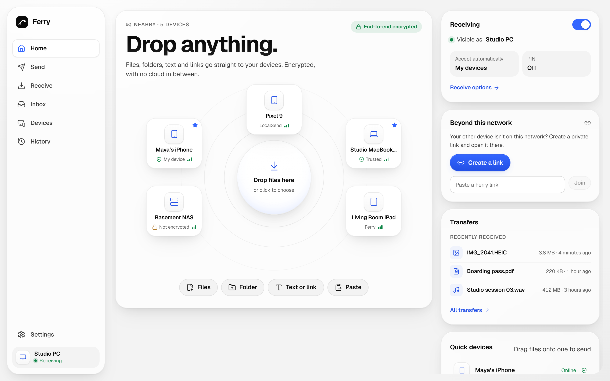
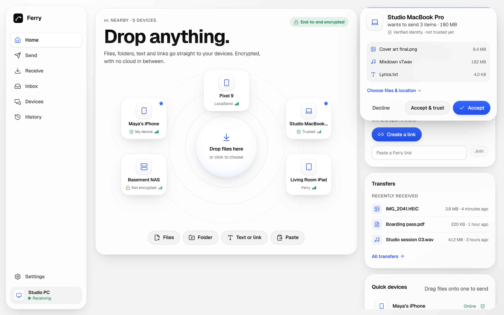
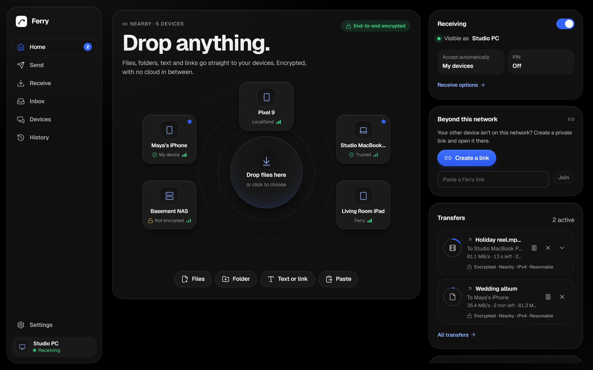
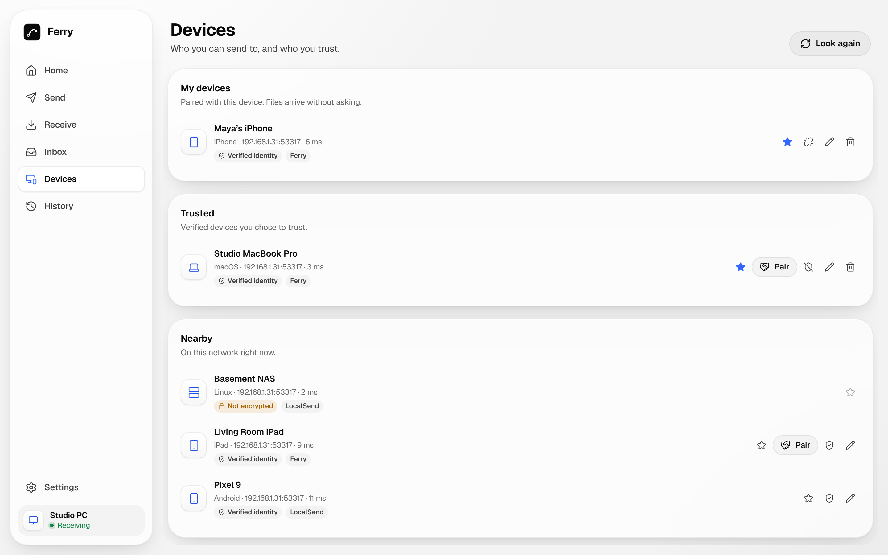
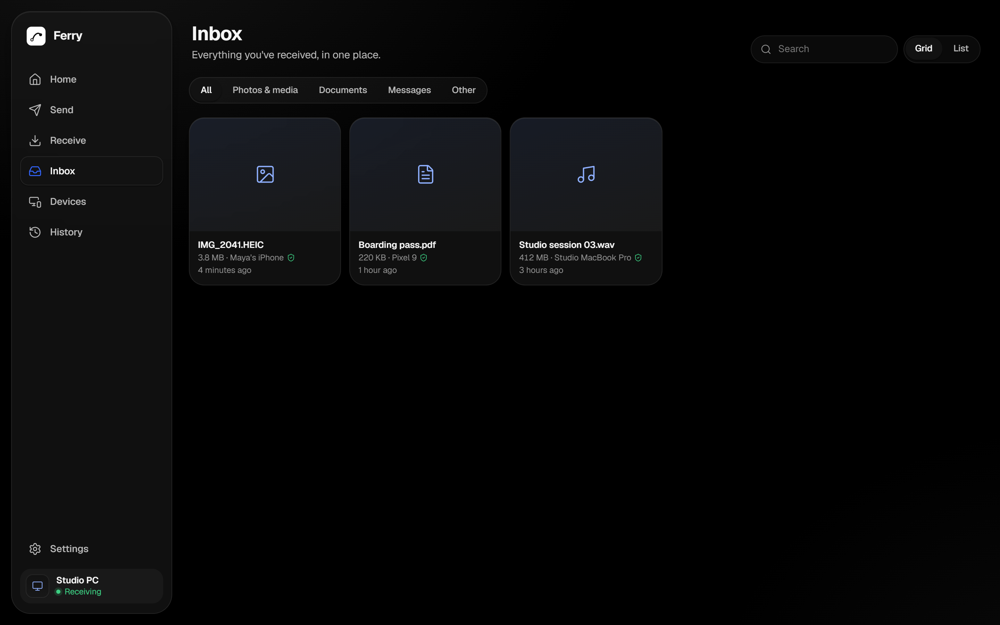
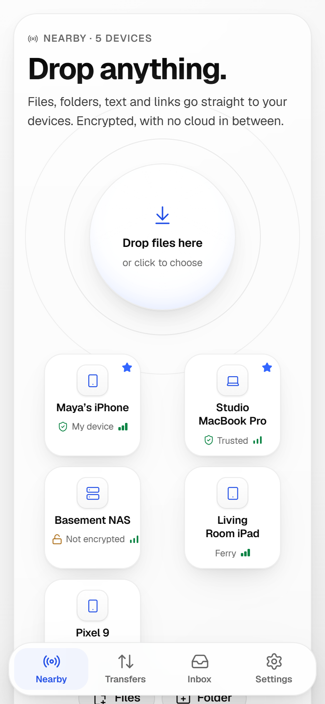
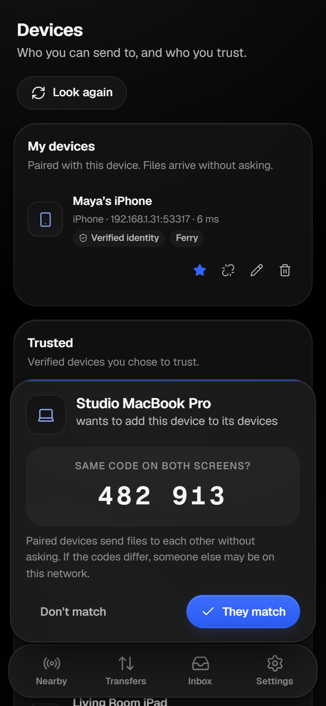

<p align="center">
  
</p>

<h1 align="center">Ferry</h1>

<p align="center">
  Fast, private file sharing between your devices.<br>
  No account, no cloud copy. Works with LocalSend.
</p>

<p align="center">
  <a href="https://github.com/F7rx/Ferry/actions/workflows/ci.yml"></a>
  <a href="LICENSE"></a>
  <a href="https://github.com/F7rx/Ferry/releases/latest"></a>
</p>

<picture>
  <source media="(prefers-color-scheme: dark)" srcset="docs/screenshots/home-dark.png">
  
</picture>

Files, folders, text and links go straight from one device to another,
encrypted end to end. Ferry speaks the LocalSend protocol, so it works with the
LocalSend devices you already have, and adds resumable transfers, several
incoming transfers at once, sending to many devices in one drop, Quick Drop onto
device tiles, an Inbox, and a hardened security model.

> **Status:** early but working. The desktop app, the `ferry` CLI and the
> browser app work end to end on the local network and over WebRTC. The desktop
> app is tested by hand on Windows; the macOS and Linux builds compile and pass
> CI but haven't been tested by hand yet. Android and iOS apps are planned.

## Screenshots

<table>
  <tr>
    <td width="50%"><p align="center"><sub>Accept, decline or pick files before anything arrives</sub></p></td>
    <td width="50%"><p align="center"><sub>Several transfers at once, each resumable</sub></p></td>
  </tr>
  <tr>
    <td><p align="center"><sub>Paired, trusted and nearby devices</sub></p></td>
    <td><p align="center"><sub>Everything you've received, in one place</sub></p></td>
  </tr>
</table>

<p align="center">
  
  &nbsp;&nbsp;
  
</p>

## Features

- **Works with LocalSend.** Discovery and transfers interoperate with unmodified LocalSend, in both directions.
- **Encrypted by default.** HTTPS with mutual TLS and pinned certificates on the local network; DTLS over WebRTC beyond it.
- **Resumable transfers.** A dropped network or a restarted receiver continues from the last confirmed byte, and sends on the local network can be paused and resumed.
- **Group drop.** Send to several devices at once, each with its own progress.
- **My devices.** Pair with a QR code, a link or a 6-digit code. Paired devices send to each other without prompts.
- **Beyond your network.** With a self-hostable signaling server, devices and browsers connect peer to peer from anywhere. A private link or QR code connects two devices on different networks.
- **Browser app.** The same interface as an installable web app, no download needed. Received files stay in the browser's private storage until you save them.
- **Browser links.** Share files with any browser on the same network through a QR code, or let a browser send files to you, protected by a token, an optional PIN and an expiry.
- **Careful with your files.** Hostile file names and path tricks are rejected, nothing gets overwritten, memory use stays flat, and there is no telemetry.

## Download

Installers for Windows, macOS and Linux are on the
[releases page](https://github.com/F7rx/Ferry/releases/latest):

| Platform | File |
|---|---|
| Windows 10 and 11 | `Ferry_x.y.z_x64-setup.exe` (or the `.msi`) |
| macOS | `Ferry_x.y.z_universal.dmg` (Apple silicon and Intel) |
| Linux | `.AppImage`, `.deb` or `.rpm` |

Only the Windows installer has been tested by hand so far. The installers
aren't code-signed yet. On Windows, SmartScreen may show
"Windows protected your PC": select **More info**, then **Run anyway**. On
macOS, if it says Apple can't check the app, open **System Settings ›
Privacy & Security** and select **Open Anyway**.

## Building from source

You need Rust 1.97 and Node 22 or newer.
On Windows, install the MSVC build tools (WebView2 ships with Windows 11).
On Linux, install the [Tauri system packages](https://v2.tauri.app/start/prerequisites/)
(on Ubuntu 22.04: `libwebkit2gtk-4.1-dev libappindicator3-dev librsvg2-dev patchelf`).

```sh
npm install

# Desktop app
cd apps/app && npx tauri dev       # development
cd apps/app && npx tauri build     # installers in target/release/bundle
```

### Command line

```sh
cargo run -p ferry-cli -- receive --accept ask
cargo run -p ferry-cli -- send ./photos --to "Maya's iPhone"
cargo run -p ferry-cli -- devices
cargo run -p ferry-cli -- share ./slides.pdf       # link and QR code for any browser on the network
cargo run -p ferry-cli -- receive --browser        # let browsers upload to you
cargo run -p ferry-cli -- pair show                # pairing QR code and link
cargo run -p ferry-cli -- pair with "Studio PC"    # pair by comparing a 6-digit code
```

### Browser app

The browser app finds other devices through a small signaling server that only
relays connection setup. Files always go device to device.

```sh
cargo run -p ferry-signal                                      # ws://127.0.0.1:3000/v1/ws
VITE_FERRY_SIGNAL_URL=ws://127.0.0.1:3000/v1/ws npm run dev    # open it in two browsers
```

To host the signaling server yourself, see [crates/ferry-signal](crates/ferry-signal/README.md).

To work on the interface without a second device, run `npm run dev` and open
`http://localhost:5173/?demo`, which shows simulated devices.

## Repository

| Path | |
|---|---|
| `crates/ferry-core` | The transfer engine (Rust, Tokio). No UI dependencies. |
| `crates/ferry-cli` | The `ferry` command line app. |
| `crates/ferry-signal` | Self-hostable WebRTC signaling server. |
| `crates/localsend` | Vendored LocalSend protocol core (Apache-2.0). Changes are listed in its `UPSTREAM.md`. |
| `apps/app` | The interface (Vue 3) for the desktop and browser apps. `src-tauri/` is the desktop shell. |
| `tests/interop` | Interop tests against unmodified upstream LocalSend. |
| `docs` | Architecture, protocol, threat model, platform notes and design system. |

## Documentation

- [Architecture](docs/02-architecture.md)
- [Protocol and extensions](docs/05-protocol.md)
- [Threat model](docs/04-threat-model.md)
- [Platform limitations](docs/03-platform-limitations.md)
- [Design system](docs/design-system.md)

## Contributing

Pull requests are welcome. Read [CONTRIBUTING.md](CONTRIBUTING.md) for setup,
the checks CI runs and the guidelines. Report security issues privately as
described in [SECURITY.md](SECURITY.md).

## License

Apache-2.0. Ferry includes software derived from
[LocalSend](https://github.com/localsend/localsend) (Apache-2.0); see
[NOTICE](NOTICE). Ferry is not affiliated with or endorsed by LocalSend.
